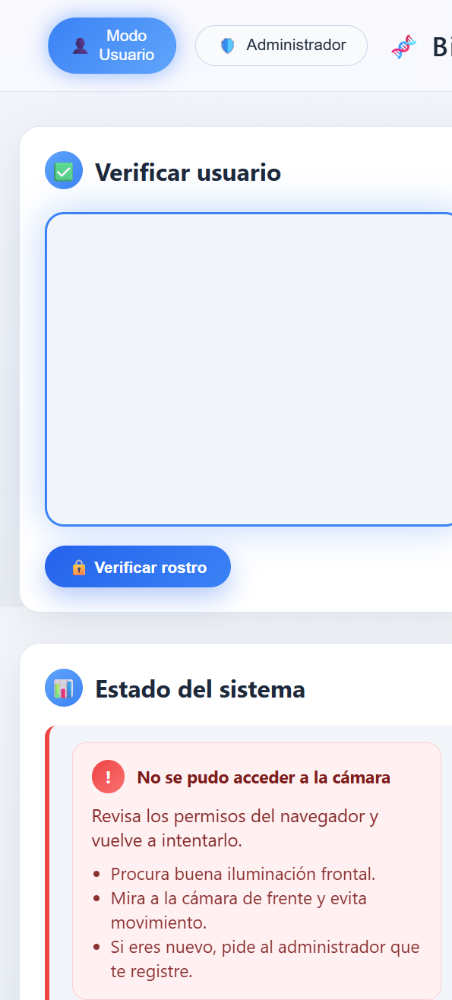
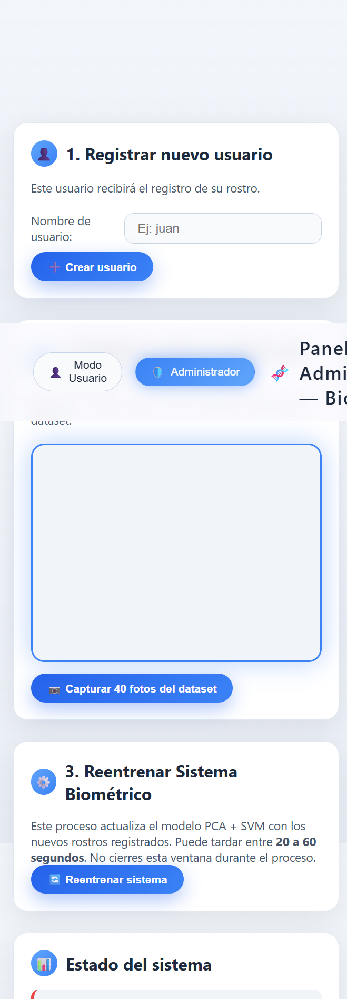

# BioAccess

BioAccess is a Django-based biometric web application for registering users, capturing face datasets, retraining the model, and verifying identity through a webcam.

The application has two working modes:

- User mode, for identity verification through the camera.
- Admin panel, for registering users, collecting face samples, and retraining the system.

## Features

- Separate web interfaces for user mode and admin mode.
- Automatic capture of 40 face samples per user.
- Face detection with Haar Cascade and normalized grayscale cropping.
- PCA + SVM training pipeline.
- Verification with confidence, margin, and distance checks to reject weak matches.
- Local storage for datasets and trained models inside `data/`.

## Screenshots

### User mode



### Admin panel



## Demo video

A short demo video is included in the repository:

- [docs/demo.mp4](docs/demo.mp4)

## Quick Demo Flow

Recommended usage flow:

1. Open the admin panel.
2. Enter a username and create it.
3. Capture the 40 face samples from the camera.
4. Retrain the biometric system.
5. Switch to user mode and verify the registered face.

```mermaid
flowchart TD
    A[Admin] --> B[Create user]
    B --> C[Capture 40 photos]
    C --> D[Retrain PCA + SVM]
    D --> E[User mode]
    E --> F[Verify face]
    F --> G{Match?}
    G -->|Yes| H[Access granted]
    G -->|No| I[Access denied]
```



## Technology Stack

- Django 5.0.6
- OpenCV
- NumPy
- scikit-learn
- Joblib
- WhiteNoise

## Project Structure

```text
manage.py
authentication/
biometrics/
data/
  models/
  processed_faces/
static/
  css/
  js/
templates/
docs/
  images/
  demo.mp4
```

## Requirements

- Python 3.12 or compatible
- Webcam
- Modern browser with camera permissions enabled

## Installation

1. Create and activate a virtual environment.

   On Windows:

   ```powershell
   python -m venv env
   .\env\Scripts\activate
   ```

2. Install dependencies.

   ```powershell
   pip install -r requirements.txt
   ```

3. Run migrations and start the development server.

   ```powershell
   python manage.py migrate
   python manage.py runserver
   ```

4. Open the application in your browser.

   ```text
   http://127.0.0.1:8000/
   ```

## Usage

### 1. Register a user

Go to `http://127.0.0.1:8000/admin-panel/`, enter a username, and click **Create user**. This creates the folder `data/processed_faces/<username>`.

### 2. Capture the face dataset

After creating the user, click **Capture 40 photos of the dataset**. The app captures multiple webcam frames and stores them as grayscale face crops.

### 3. Retrain the model

Click **Retrain system** to update the models stored in `data/models/`:

- `face_pca.joblib`
- `face_svm.joblib`
- `label_encoder.joblib`
- `class_centroids.joblib`

### 4. Verify identity

Open user mode, look at the camera, and click **Verify face**. The system returns access granted or denied depending on the model result.

## API Endpoints

| Method | Route | Description |
| --- | --- | --- |
| GET | `/` | Main user view |
| GET | `/admin-panel/` | Admin dashboard |
| POST | `/api/register-user/` | Creates the user folder |
| POST | `/api/capture-face/` | Saves a face capture |
| POST | `/api/retrain/` | Retrains PCA + SVM |
| POST | `/api/verify/` | Verifies the face |

## Biometric Pipeline

The recognition flow works as follows:

1. The face is detected with Haar Cascade.
2. The crop is resized to `settings.IMG_SIZE`.
3. The image is normalized in grayscale.
4. Dimensionality is reduced with PCA.
5. Classification is performed with an RBF SVM.
6. Acceptance thresholds are applied to reduce false positives.

The rejection thresholds can be tuned through environment variables:

- `FACE_THRESH_PROBA`
- `FACE_THRESH_MARGIN`
- `FACE_THRESH_DIST`

## Data and Models

- `data/processed_faces/`: user face samples.
- `data/models/`: trained models and label encoder.

## Production Notes

- Change `SECRET_KEY` before publishing.
- Set `DEBUG = False` in production.
- Update `ALLOWED_HOSTS` for your deployment.
- Use HTTPS and proper camera permissions if you deploy publicly.

## License

No explicit license is defined in the project yet. Add one before distributing or publishing the application.